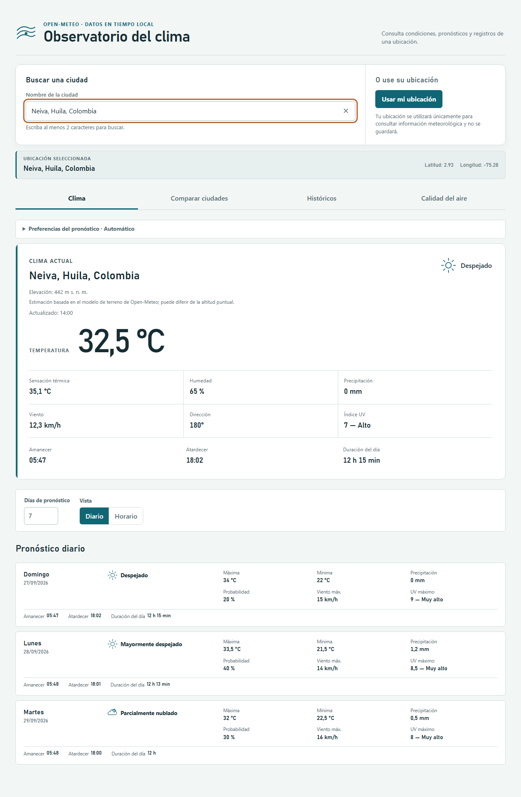
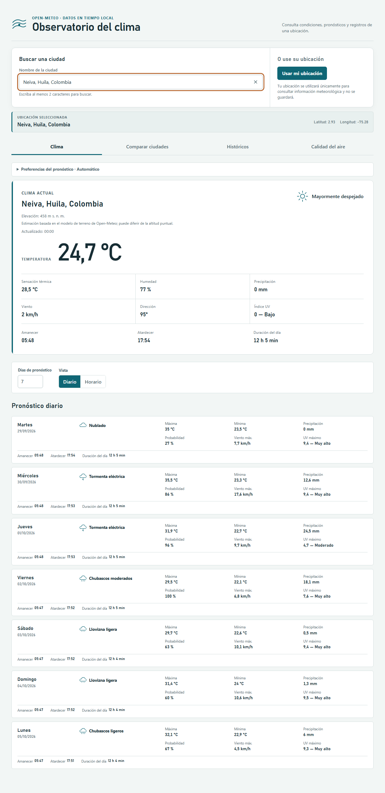

# Resultado de Ejecución — TC-JC-011

| Campo | Valor |
|---|---|
| **ID del Caso** | **TC-JC-011** |
| **Nombre** | Amanecer, atardecer y duración del día (valores válidos) |
| **Componente / Endpoint** | `GET /v1/forecast` (bloque daily: `sunrise`, `sunset`, `daylight_duration`) |
| **Tipo de Prueba** | Funcional |
| **Prioridad** | Media |
| **Tester** | Juan Camilo La Rotta |
| **Fecha de Ejecución** | 27/09/2026 (Ejecución automatizada: 28/09/2026) |
| **Ubicación Activa** | Neiva, Huila |
| **Estado Global** | **APROBADO** ✅ |
| **Duración de Ejecución** | 6.4 s |

---

## 🎯 Objetivo de la Prueba

Verificar que, para cada día del pronóstico de Neiva, Huila, se muestren correctamente la hora de amanecer, atardecer y la duración del día en hora local, utilizando el formato de 24 horas (`HH:mm`) y el formato `'X h Y min'` (o `'X h'`), asegurando la inclusión de etiquetas textuales explícitas (`Amanecer`, `Atardecer`, `Duración del día`).

---

## 📋 Criterios de Aceptación Evaluados

| # | Criterio de Aceptación | Estado | Observación |
|---|---|:---:|---|
| **1** | Las horas de amanecer y atardecer se muestran en formato 24 h (`HH:mm`), coincidiendo exactamente con los valores ISO 8601 de la API. | **CUMPLE** | `formatForecastTime` extrae la porción `HH:mm` de cadenas ISO8601. |
| **2** | La duración del día se presenta como `'X h Y min'` (o `'X h'`), calculada correctamente desde `daylight_duration` (segundos). | **CUMPLE** | `formatDaylightDuration` convierte los segundos dividiendo por 60 y calculando horas/minutos exactos. |
| **3** | Cada dato incluye una etiqueta textual (`Amanecer` / `Atardecer` / `Duración del día`), no solo un ícono. | **CUMPLE** | Cada métrica se renderiza dentro de un elemento `<dt>` HTML estándar con su texto explícito. |

---

## 🧪 Escenarios de Prueba Ejecutados

### 🔹 ESC-A: Datos controlados (Mock) — Neiva (3 Días de Pronóstico)

* **Propósito**: Validar la precisión matemática de la conversión y el renderizado exacto en el DOM.
* **Datos de prueba inyectados**:
  * **Día 0**: `sunrise`: `'2026-09-27T05:47'`, `sunset`: `'2026-09-27T18:02'`, `daylight_duration`: `44100` s (44100 / 60 = 735 min = 12 h 15 min).
  * **Día 1**: `sunrise`: `'2026-09-28T05:48'`, `sunset`: `'2026-09-28T18:01'`, `daylight_duration`: `43980` s (43980 / 60 = 733 min = 12 h 13 min).
  * **Día 2**: `sunrise`: `'2026-09-29T05:48'`, `sunset`: `'2026-09-29T18:00'`, `daylight_duration`: `43200` s (43200 / 60 = 720 min = 12 h 0 min -> `'12 h'`).
* **Resultado Esperado**:
  * Tarjeta principal de Clima Actual: Amanecer = `05:47`, Atardecer = `18:02`, Duración = `12 h 15 min`.
  * Tarjeta Día 0: Amanecer = `05:47`, Atardecer = `18:02`, Duración = `12 h 15 min`.
  * Tarjeta Día 1: Amanecer = `05:48`, Atardecer = `18:01`, Duración = `12 h 13 min`.
  * Tarjeta Día 2: Amanecer = `05:48`, Atardecer = `18:00`, Duración = `12 h`.
* **Resultado Obtenido**: **APROBADO**. Todos los selectores coincidieron exactamente con los valores esperados.
* **Evidencia visual**: `evidencias/TC-JC-011__2026-09-28__run01/01_valores_validos_mock.png`

---

### 🔹 ESC-B: Integración con API Real — Neiva

* **Propósito**: Verificar en un entorno real que la respuesta de Open-Meteo `/v1/forecast` despliegue las horas solares adecuadamente formateadas.
* **Datos de prueba**: Consulta directa a `/v1/forecast` para la ubicación Neiva.
* **Resultado Esperado**: Todos los días del rango de pronóstico deben tener horas en patrón `^\d{2}:\d{2}$` y duración en `^\d+\s*h(\s+\d+\s*min)?$`.
* **Resultado Obtenido**: **APROBADO**. Todos los días mostrados en la interfaz cumplieron rigurosamente el formato exigido.
* **Evidencia visual**: `evidencias/TC-JC-011__2026-09-28__run01/02_valores_validos_api_real.png`

---

## 📸 Evidencias Fotográficas

| Escenario | Captura |
|---|---|
| **ESC-A: Mock Controlado** |  |
| **ESC-B: API Real Neiva** |  |

---

## 🔍 Detalles Técnicos de Código Relevantes

1. **Extracción de Hora HH:mm**:
   ```typescript
   export function formatForecastTime(value: string): string | null {
     return /T(\d{2}:\d{2})/.exec(value)?.[1] ?? null;
   }
   ```
2. **Conversión de Segundos a Formato Humano**:
   ```typescript
   export function formatDaylightDuration(seconds: number | null): string {
     if (seconds === null || !Number.isFinite(seconds) || seconds < 0) return 'No disponible';
     const totalMinutes = Math.floor(seconds / 60);
     const hours = Math.floor(totalMinutes / 60);
     const minutes = totalMinutes % 60;
     return minutes === 0 ? `${hours} h` : `${hours} h ${minutes} min`;
   }
   ```
3. **Estructura HTML con Etiquetas Textuales**:
   ```tsx
   <dl className="forecast-panel__solar" aria-label="Luz del día">
     <div><dt>Amanecer</dt><dd>{formatForecastTime(day.sunrise ?? '') ?? 'No disponible'}</dd></div>
     <div><dt>Atardecer</dt><dd>{formatForecastTime(day.sunset ?? '') ?? 'No disponible'}</dd></div>
     <div><dt>Duración del día</dt><dd>{formatDaylightDuration(day.daylightDuration)}</dd></div>
   </dl>
   ```

---

## 📌 Conclusión

El caso **TC-JC-011** ha sido validado exhaustivamente. La aplicación procesa y presenta correctamente los campos de amanecer (`sunrise`), atardecer (`sunset`) y duración del día (`daylight_duration`) conforme a las especificaciones del cliente y los criterios de aceptación de la historia de usuario.
