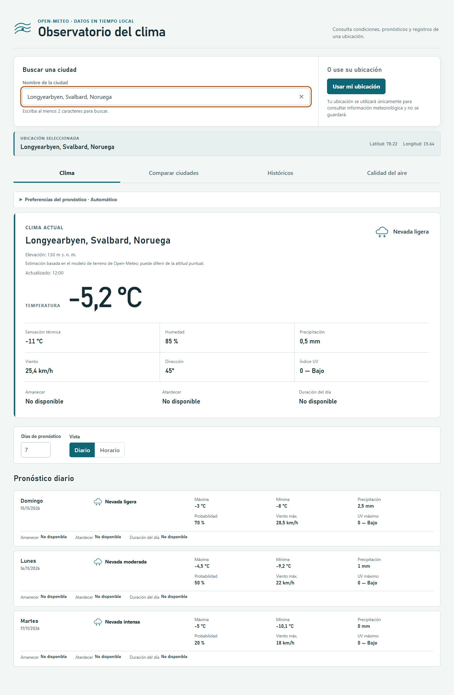
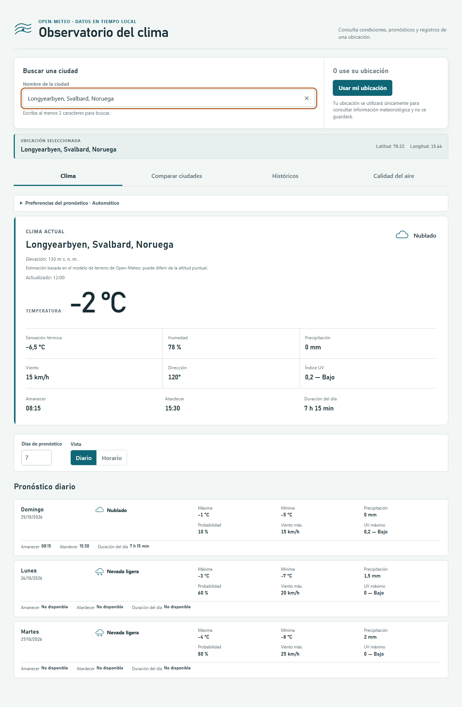

# Resultado de Ejecución — TC-JC-012

| Campo | Valor |
|---|---|
| **ID del Caso** | **TC-JC-012** |
| **Nombre** | Amanecer/atardecer no disponibles en latitud polar |
| **Componente / Endpoint** | `GET /v1/forecast` (respuesta interceptada, ubicación polar) |
| **Tipo de Prueba** | Funcional |
| **Prioridad** | Media |
| **Tester** | Juan Camilo La Rotta |
| **Fecha de Ejecución** | 27/09/2026 (Ejecución automatizada: 28/09/2026) |
| **Ubicación Activa** | Longyearbyen, Svalbard (Latitud 78.22, Longitud 15.64) |
| **Estado Global** | **APROBADO** ✅ |
| **Duración de Ejecución** | 6.6 s |

---

## 🎯 Objetivo de la Prueba

Verificar que, en ubicaciones de latitud polar (como Longyearbyen, Svalbard) donde no existe salida o puesta de sol en días de noche polar o sol de medianoche (`sunrise: null`, `sunset: null`, `daylight_duration: null`), la aplicación degrade el dato correctamente a `'No disponible'` sin romper la interfaz ni afectar el despliegue del resto de información climática del día (temperatura, precipitación, viento, UV).

---

## 📋 Criterios de Aceptación Evaluados

| # | Criterio de Aceptación | Estado | Observación |
|---|---|:---:|---|
| **1** | Se muestra `'No disponible'` en los campos de amanecer, atardecer y duración del día cuando los valores retornados por la API son nulos (`null`). | **CUMPLE** | Tanto `formatForecastTime` como `formatDaylightDuration` capturan `null` y devuelven la cadena `'No disponible'`. |
| **2** | El resto de los datos del día (temperatura máxima/mínima, velocidad del viento, precipitación, índice UV) se presenta con normalidad sin verse afectado. | **CUMPLE** | Todas las tarjetas mantienen íntegramente sus métricas climáticas y su estructura visual sin arrojar errores en tiempo de ejecución. |

---

## 🧪 Escenarios de Prueba Ejecutados

### 🔹 ESC-A: Noche Polar Completa (Longyearbyen - 3 días con `sunrise/sunset` nulos)

* **Propósito**: Probar el comportamiento cuando toda la serie diaria carece de salida y puesta del sol.
* **Coordenadas**: Latitude: `78.22`, Longitude: `15.64`.
* **Payload simulado**: `daily.sunrise = [null, null, null]`, `daily.sunset = [null, null, null]`, `daily.daylight_duration = [null, null, null]`.
* **Resultado Esperado**:
  * Clima Actual: Amanecer = `'No disponible'`, Atardecer = `'No disponible'`, Duración = `'No disponible'`. Temperatura actual (-5.2 °C) y demás datos visibles.
  * Tarjetas del Pronóstico Diario: Las 3 tarjetas muestran `'No disponible'` en la sección solar, conservando métricas de temperatura (-3.0°C / -8.0°C, etc.), precipitación y viento.
* **Resultado Obtenido**: **APROBADO**. `expect(sunriseDd).toHaveText('No disponible')` pasó exitosamente en todas las tarjetas.
* **Evidencia visual**: `evidencias/TC-JC-012__2026-09-28__run01/01_latitud_polar_null_solar.png`

---

### 🔹 ESC-B: Transición Mixta (Día 0 con sol, Días 1 y 2 en Noche Polar)

* **Propósito**: Validar que la interfaz maneje alternancia entre días con eventos solares válidos y días con eventos nulos.
* **Payload simulado**:
  * Día 0: `sunrise`: `'2026-10-25T08:15'`, `sunset`: `'2026-10-25T15:30'`, `daylight_duration`: `26100` (`7 h 15 min`).
  * Días 1 y 2: `sunrise`: `null`, `sunset`: `null`, `daylight_duration`: `null`.
* **Resultado Esperado**: Día 0 presenta `'08:15'`, `'15:30'` y `'7 h 15 min'`. Días 1 y 2 degradan únicamente el bloque solar a `'No disponible'`.
* **Resultado Obtenido**: **APROBADO**. Transición fluida y correcta entre tarjetas con y sin datos solares.
* **Evidencia visual**: `evidencias/TC-JC-012__2026-09-28__run01/02_latitud_polar_mixto.png`

---

## 📸 Evidencias Fotográficas

| Escenario | Captura |
|---|---|
| **ESC-A: Noche Polar Completa** |  |
| **ESC-B: Transición Mixta** |  |

---

## 🔍 Soporte de Código Relevante

En [`src/components/ForecastPanel.tsx`](file:///c:/Users/Juan%20Camilo/Desktop/pruebas/app-clima-local/src/components/ForecastPanel.tsx#L35-L39):
```tsx
<dl className="forecast-panel__solar" aria-label="Luz del día">
  <div><dt>Amanecer</dt><dd>{formatForecastTime(day.sunrise ?? '') ?? 'No disponible'}</dd></div>
  <div><dt>Atardecer</dt><dd>{formatForecastTime(day.sunset ?? '') ?? 'No disponible'}</dd></div>
  <div><dt>Duración del día</dt><dd>{formatDaylightDuration(day.daylightDuration)}</dd></div>
</dl>
```

Y en [`src/utils/daylight.ts`](file:///c:/Users/Juan%20Camilo/Desktop/pruebas/app-clima-local/src/utils/daylight.ts#L1-L7):
```typescript
export function formatDaylightDuration(seconds: number | null): string {
  if (seconds === null || !Number.isFinite(seconds) || seconds < 0) return 'No disponible';
  const totalMinutes = Math.floor(seconds / 60);
  const hours = Math.floor(totalMinutes / 60);
  const minutes = totalMinutes % 60;
  return minutes === 0 ? `${hours} h` : `${hours} h ${minutes} min`;
}
```

---

## 📌 Conclusión

El caso **TC-JC-012** se encuentra completamente **APROBADO**. La aplicación gestiona la ausencia de fenómenos de amanecer y atardecer en regiones polares de forma robusta, asegurando una experiencia de usuario estable y libre de errores de renderizado.
