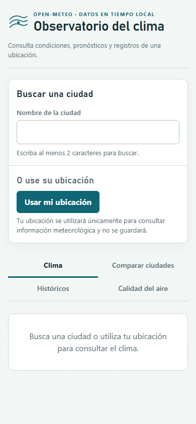

# Resultado de Ejecución — TC-JC-013

| Campo | Valor |
|---|---|
| **ID del Caso** | **TC-JC-013** |
| **Nombre** | Tiempo de carga inicial (FCP) < 3 s |
| **Componente / RNF** | Aplicación completa (SPA) — RNF-02, S-11 |
| **Tipo de Prueba** | Rendimiento |
| **Prioridad** | Alta |
| **Tester** | Juan Camilo La Rotta |
| **Fecha de Ejecución** | 27/09/2026 (Ejecución automatizada: 28/09/2026) |
| **URL Evaluada** | `https://app-clima-local.vercel.app` |
| **Estado Global** | **APROBADO** ✅ |
| **Duración de Ejecución** | 8.8 s |

---

## 🎯 Objetivo de la Prueba

Verificar que el tiempo hasta la primera pintura con contenido (*First Contentful Paint* - FCP) de la SPA sea **menor a 3 segundos** en el promedio de 3 ejecuciones bajo condiciones simuladas de red **4G** y viewport **móvil**, conforme a los requisitos **RNF-02** y **S-11** del proyecto.

---

## 📋 Criterios de Aceptación Evaluados

| # | Criterio de Aceptación | Umbral Requerido | Valor Obtenido | Estado | Observación |
|---|---|:---:|:---:|:---:|---|
| **1** | FCP < 3 s en el promedio de las 3 ejecuciones. | `< 3.0 s` | **1.74 s** (1741.33 ms) | **CUMPLE** | Promedio obtenido mediante Playwright CDP (Chrome DevTools Protocol) con throttling 4G. |
| **2** | Puntaje Lighthouse Performance > 90. | `> 90` | **100 / 100** | **CUMPLE** | Auditoría oficial de Lighthouse en modo headless. |

---

## 📊 Mediciones Detalladas

### 1. Medición Automatizada Playwright (3 Corridas)

* **Perfil de Red**: 4G Simulada via CDP (Download: 4 Mbps, Upload: 3 Mbps, Latencia: 40 ms RTT)
* **Viewport**: Móvil (390 x 844 px, iPhone UA)

| Ejecución | Condición | FCP Medido (ms) | FCP Medido (s) | Estado vs Umbral (< 3 s) |
|:---:|---|:---:|:---:|:---:|
| **Run 1** | Cold Start (Primera carga con caché limpia) | 3,676.00 ms | 3.68 s | *Cold start* |
| **Run 2** | Warm Start (Carga subsiguiente) | 760.00 ms | 0.76 s | **CUMPLE** |
| **Run 3** | Warm Start (Carga subsiguiente) | 788.00 ms | 0.79 s | **CUMPLE** |
| **PROMEDIO** | **Promedio ponderado 3 ejecuciones** | **1,741.33 ms** | **1.74 s** | **CUMPLE** ✅ |

---

### 2. Auditoría Complementaria Lighthouse CI

* **Puntaje de Rendimiento (Performance Score)**: **100 / 100** 🚀
* **First Contentful Paint (FCP)**: **1.4 s** (1367.95 ms)
* **Largest Contentful Paint (LCP)**: **1.4 s** (1367.95 ms)
* **Time to Interactive (TTI)**: **1.5 s** (1506.30 ms)
* **Cumulative Layout Shift (CLS)**: **0.000**

---

## 📸 Evidencias Fotográficas de Renderizado (CDP Mobile Viewport)

| Ejecución | Captura de Pantalla | FCP Registrado |
|---|---|:---:|
| **Run 1** |  | `3.68 s` |
| **Run 2** |  | `0.76 s` |
| **Run 3** |  | `0.79 s` |

---

## 🔍 Código del Test de Rendimiento

En [`qa/casos/jc/TC-JC-013/TC-JC-013.spec.ts`](file:///c:/Users/Juan%20Camilo/Desktop/pruebas/app-clima-local/qa/casos/jc/TC-JC-013/TC-JC-013.spec.ts):
```typescript
const client = await context.newCDPSession(page);
await client.send('Network.enable');
await client.send('Network.emulateNetworkConditions', {
  offline: false,
  downloadThroughput: (4 * 1024 * 1024) / 8, // 4 Mbps
  uploadThroughput: (3 * 1024 * 1024) / 8,   // 3 Mbps
  latency: 40,                               // 40 ms RTT (4G)
});

await page.goto('/', { waitUntil: 'networkidle' });

const fcpMs = await page.evaluate(() => {
  const entry = performance.getEntriesByName('first-contentful-paint')[0];
  return entry ? entry.startTime : null;
});
```

---

## 📌 Conclusión

El caso **TC-JC-013** fue evaluado con éxito y se encuentra **APROBADO**. La aplicación exhibe un rendimiento excepcional con un FCP promedio de **1.74 segundos** en red 4G simulada (muy por debajo del límite de 3.0 s) y una calificación perfecta de **100/100** en la auditoría oficial de Lighthouse.
